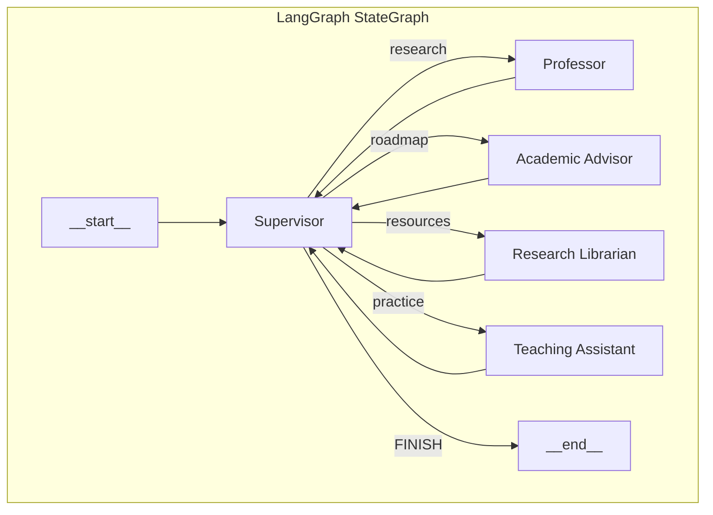

# 👨‍🏫 AI Teaching Agent Team

A multi-agent teaching system built with **LangChain**, **LangGraph**, and **LangSmith** that creates comprehensive learning packages for any topic.


## 🎓 What It Does

Enter any topic and the AI Teaching Agent Team will create:

| Agent | Output |
|-------|--------|
| 🧑‍🏫 **Professor** | Comprehensive knowledge base from first principles |
| 🧑‍🎓 **Academic Advisor** | Structured learning roadmap with milestones |
| 📚 **Research Librarian** | Curated resources (tutorials, docs, courses) |
| ✏️ **Teaching Assistant** | Practice exercises, quizzes, and projects |

All outputs are saved to Google Docs for easy sharing and reference.

## 🏗️ Architecture



**Key Features:**
- **Supervisor Pattern**: Central orchestrator routes tasks sequentially
- **Shared State**: All agents read/write to common TypedDict state
- **LangSmith Tracing**: Full observability of all LLM calls and tool usage
- **Multi-Model Support**: Use Grok, Claude, GPT-4, Gemini via OpenRouter

## 🚀 Quick Start

### 1. Clone and Install

```bash
git clone https://github.com/yourusername/ai-teaching-agent-team.git
cd ai-teaching-agent-team
pip install -r requirements.txt
```

### 2. Configure API Keys

Copy the example environment file and add your keys:

```bash
cp .env.example .env
```

Required keys:
- **OpenRouter**: Get at [openrouter.ai/keys](https://openrouter.ai/keys)
- **Composio**: Get at [composio.ai](https://composio.ai)
- **LangSmith** (optional but recommended): Get at [smith.langchain.com](https://smith.langchain.com)

### 3. Set Up Google Docs (Composio)

```bash
composio add googledocs
```

Follow the OAuth flow to connect your Google account.

### 4. Run the App

```bash
streamlit run app.py
```

## 📁 Project Structure

```
ai_teaching_agent_team/
├── src/
│   ├── __init__.py
│   ├── state.py              # Shared TypedDict state schema
│   ├── supervisor.py         # Orchestrator/router logic
│   ├── graph.py              # LangGraph StateGraph definition
│   ├── agents/
│   │   ├── professor.py      # Knowledge base creator
│   │   ├── academic_advisor.py   # Roadmap designer
│   │   ├── research_librarian.py # Resource curator
│   │   └── teaching_assistant.py # Exercise creator
│   └── tools/
│       ├── google_docs.py    # Composio integration
│       └── search.py         # DuckDuckGo/SerpAPI
├── app.py                    # Streamlit UI
├── requirements.txt
├── .env.example
└── README.md
```

## 🔧 Configuration

### Model Selection

| Model | Cost | Best For |
|-------|------|----------|
| `google/gemini-2.0-flash-exp:free` | Free | Testing |
| `x-ai/grok-4.1-fast` | Paid | Production (recommended) |
| `anthropic/claude-3.5-sonnet` | Paid | Complex reasoning |
| `openai/gpt-4o` | Paid | General purpose |

### Search Tools

- **DuckDuckGo** (default): Free, no API key needed
- **SerpAPI** (production): Enable in settings, requires API key

## 📊 LangSmith Observability

When LangSmith is configured, you get:
- Full trace of agent execution flow
- Token usage and latency metrics
- Tool invocation logs
- Error tracking and debugging

View traces at [smith.langchain.com](https://smith.langchain.com)

## 🎯 Portfolio Highlights

This project demonstrates:

| Skill | Implementation |
|-------|----------------|
| **LangGraph** | Multi-agent StateGraph with supervisor pattern |
| **LangChain** | Tool binding, prompt engineering, message handling |
| **LangSmith** | Tracing, observability, debugging |
| **State Management** | TypedDict shared state across agents |
| **Multi-Model** | OpenRouter integration for model flexibility |
| **Production Patterns** | Environment config, error handling, streaming |

## 📝 License

MIT License - feel free to use for your own portfolio!

---

*Built with ❤️ using LangChain, LangGraph, and LangSmith*
