# 👨‍🏫 AI Teaching Agent Team

A multi-agent teaching system built with **LangChain**, **LangGraph**, and **LangSmith** that creates comprehensive learning packages for any topic, automatically saving outputs to Google Docs via **MCP (Model Context Protocol)**.


## 🎓 What It Does

Enter any topic and the AI Teaching Agent Team will create:

| Agent | Output | Google Doc |
|-------|--------|------------|
| 🧑‍🏫 **Professor** | Comprehensive knowledge base from first principles | ✅ Auto-saved |
| 🧑‍🎓 **Academic Advisor** | Structured learning roadmap with milestones | ✅ Auto-saved |
| 📚 **Research Librarian** | Curated resources (tutorials, docs, courses) | ✅ Auto-saved |
| ✏️ **Teaching Assistant** | Practice exercises, quizzes, and projects | ✅ Auto-saved |

Each agent creates a separate Google Doc, linked in the final output.

## 🏗️ Architecture

```mermaid
graph TB
    subgraph "LangGraph StateGraph"
        Start["__start__"] --> Supervisor["Supervisor"]
        Supervisor -->|"research"| Professor["Professor"]
        Supervisor -->|"roadmap"| Advisor["Academic Advisor"]
        Supervisor -->|"resources"| Librarian["Research Librarian"]
        Supervisor -->|"practice"| TA["Teaching Assistant"]
        
        Professor --> Supervisor
        Advisor --> Supervisor
        Librarian --> Supervisor
        TA --> Supervisor
        
        Supervisor -->|"FINISH"| End["__end__"]
    end
    
    subgraph "External Services"
        MCP["Composio MCP Server"]
        GDocs["Google Docs API"]
        Search["Web Search"]
    end
    
    Professor --> MCP
    Advisor --> MCP
    Librarian --> MCP
    TA --> MCP
    MCP --> GDocs
    Librarian --> Search
    TA --> Search
```



### Key Features

- **Supervisor Pattern**: Central orchestrator routes tasks sequentially through specialized agents
- **Shared State**: All agents read/write to common TypedDict state using LangGraph's reducers
- **MCP Integration**: Industry-standard Model Context Protocol via Composio for reliable Google Docs access
- **Async Tool Execution**: MCP tools use async `ainvoke()` with `nest_asyncio` for Streamlit compatibility
- **LangSmith Tracing**: Full observability of all LLM calls, tool usage, and state transitions
- **Multi-Model Support**: Use Grok, Claude, GPT-4, Gemini via OpenRouter

## 🚀 Quick Start

### 1. Clone and Install

```bash
git clone https://github.com/Sim-Security/ai-teaching-agent-team.git
cd ai-teaching-agent-team
pip install -r requirements.txt
```

### 2. Configure API Keys

Copy the example environment file:

```bash
cp .env.example .env
```

Edit `.env` with your keys:

```env
# Required
OPENROUTER_API_KEY=your_openrouter_key
COMPOSIO_API_KEY=your_composio_key
COMPOSIO_USER_ID=your_composio_user_id
COMPOSIO_MCP_CONFIG_ID=your_mcp_config_id

# Recommended
LANGSMITH_API_KEY=your_langsmith_key
LANGSMITH_TRACING=true
LANGSMITH_PROJECT=ai-teaching-agent-team
```

### 3. Set Up Composio MCP (Required for Google Docs)

1. **Create account**: [platform.composio.dev](https://platform.composio.dev)
2. **Connect Google Docs**: Go to Connections tab and connect your Google account
3. **Create MCP Config**: Go to [MCP Configs](https://platform.composio.dev/mcp-configs)
   - Add `googledocs` toolkit
   - Copy the MCP Config ID to your `.env`
4. **Copy User ID**: Found in your Composio dashboard

### 4. Run the App

```bash
streamlit run app.py
```

## 📁 Project Structure

```
ai_teaching_agent_team/
├── src/
│   ├── __init__.py
│   ├── state.py              # Shared TypedDict state schema
│   ├── supervisor.py         # Orchestrator/router logic
│   ├── graph.py              # LangGraph StateGraph definition
│   ├── agents/
│   │   ├── __init__.py
│   │   ├── utils.py          # Shared utilities (async tool invocation)
│   │   ├── professor.py      # Knowledge base creator
│   │   ├── academic_advisor.py   # Roadmap designer
│   │   ├── research_librarian.py # Resource curator
│   │   └── teaching_assistant.py # Exercise creator
│   └── tools/
│       ├── __init__.py
│       ├── google_docs.py    # MCP/Composio integration
│       └── search.py         # DuckDuckGo/SerpAPI
├── app.py                    # Streamlit UI
├── requirements.txt
├── .env.example
└── README.md
```

## 🔧 Configuration

### Model Selection

| Model | Cost | Best For |
|-------|------|----------|
| `google/gemini-2.0-flash-exp:free` | Free | Testing & development |
| `x-ai/grok-4.1-fast` | $5/M input | Production (recommended) |
| `anthropic/claude-3.5-sonnet` | $3/M input | Complex reasoning |
| `openai/gpt-4o` | $2.50/M input | General purpose |
| `openai/gpt-4o-mini` | $0.15/M input | Budget production |

### Search Tools

- **DuckDuckGo** (default): Free, no API key needed
- **SerpAPI** (production): Enable in settings, requires `SERPAPI_API_KEY`

### Environment Variables

| Variable | Required | Description |
|----------|----------|-------------|
| `OPENROUTER_API_KEY` | ✅ | Access to LLM models |
| `COMPOSIO_API_KEY` | ✅ | Composio authentication |
| `COMPOSIO_USER_ID` | ✅ | Your Composio user ID |
| `COMPOSIO_MCP_CONFIG_ID` | ✅ | MCP server config for Google Docs |
| `LANGSMITH_API_KEY` | Recommended | Tracing and observability |
| `SERPAPI_API_KEY` | Optional | Production search (vs free DuckDuckGo) |

## 📊 LangSmith Observability

When LangSmith is configured, you get:
- Full trace of agent execution flow
- State inspection at each node
- Token usage and latency metrics
- Tool invocation logs with inputs/outputs
- Error tracking and debugging

View traces at [smith.langchain.com](https://smith.langchain.com)

## 🔌 MCP Integration

This project uses the **Model Context Protocol (MCP)** for tool integration:

```python
# MCP provides standardized tool access
from langchain_mcp_adapters.client import MultiServerMCPClient

# Tools are invoked asynchronously for reliability
result = await tool.ainvoke({"title": title, "text": content})
```

**Why MCP?**
- Industry standard (adopted by OpenAI, Anthropic)
- Reliable tool schema handling
- No manual parameter matching errors
- Centralized authentication

## 🎯 Portfolio Highlights

This project demonstrates:

| Skill | Implementation |
|-------|----------------|
| **LangGraph** | Multi-agent StateGraph with supervisor pattern |
| **LangChain** | Tool binding, prompt engineering, message handling |
| **LangSmith** | Tracing, observability, debugging |
| **MCP** | Model Context Protocol via Composio for tool access |
| **State Management** | TypedDict shared state with proper reducers |
| **Async Patterns** | `nest_asyncio` + `ainvoke()` for Streamlit compat |
| **Multi-Model** | OpenRouter integration for model flexibility |
| **Production Patterns** | Environment config, error handling, streaming UI |

## 🐛 Troubleshooting

### "No Google Docs tools available"
- Ensure `COMPOSIO_MCP_CONFIG_ID` is set in `.env`
- Verify Google Docs is connected in Composio dashboard
- Check the MCP Config includes the `googledocs` toolkit

### "StructuredTool does not support sync invocation"
- This is fixed - tools now use async `ainvoke()` with `nest_asyncio`

### Empty documents created
- Fixed: Content is now passed to the `text` parameter correctly
- MCP tools require async invocation which is handled automatically

## 📝 License

MIT License - feel free to use for your own portfolio!

---

*Built with ❤️ using LangChain, LangGraph, LangSmith, and Composio MCP*
